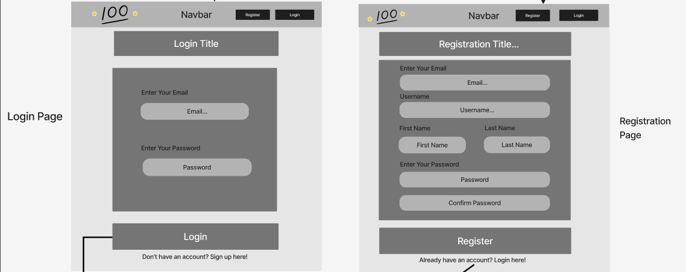
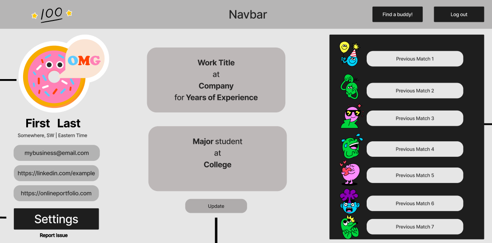

# Project Plan

Pod Members:

  - Lacie Covington
  - Miles Baffour
  - Gabriel Bremo

## Problem Statement and Description

Roughly 70 percent of people fail to achieve the goals they have set for themselves, especially when it comes to completing work and study goals, due a multitude of reasons (lack of motivation, failing to plan, inactivity, etc.) One of the main advice that people are given when they want to achieve a goal is to find an Accountability Partner, due to the fact that having an Accountability Partner will increase your chances to success by 95%; however, oftentimes it's hard for people to find an Accountability Partner. This project makes it easier fo someone to find people who share the same desires of keeping themselves on track with their goals free of charge and allows users to be able to specify what they want to work at that time and then get matched with someone with similar goals into a virtual room where they would sit down together and work towards their tasks in that session.

## User Roles and Personas

### User Roles

Buddy: a user who is seeking to remain productive, to find motivation, and for possible networking opportunities

### User Personas

#### Peter:

Peter is a sophomore at college living in a suburb in Miami, Florida. He is looking forward to transferring to a University by the end of the year but fears his grade point average may lower before that happens. As a full-time student and employee at the same time, he struggles to stay motivated after extensive work shifts, and often sacrifices coursework for some rest or recreation. Additionally, as an online student, he lacks acquaintances to study with on campus, and therefore looks for a way to study with someone that fits into his schedule.

#### Lisa:

Lisa is a 25 year old professional software engineer, currently working at a startup in Chicago, Illinois. Lisa is fairly experienced in the field, so accordingly she has great knowledge of computer programming. The company Lisa works for greatly encourages working remotely, so she typically uses her desktop for doing work. Although she stays home most of the time, Lisa always loves meeting and working with people who are also passionate about programming. After searching for a solution that could help fulfill this hobby, she discovered [our app]. Now she can meet and study with others who share similar interests.

#### Maria:

Maria is a 31 year old living in Boulder, Colorado. She is a full-time worker who has been learning python on her own through udemy courses at her own pace. Although she feels she has made considerable progress in her self-study, she wants to invest more of her time in her studies than before; for that, she would like to count on the motivation, support and feedback that a peer or classmate provides. Maria is seeking to interact with students with the same area of focus in order to network and earn a more complete learning experience.

#### John:

John is a 35 year old music artist from Los Angeles, California. As a musician, John loves to travel to different areas of the country to look for opportunities and to draw inspiration. So he always brings his laptop with him. However, because John is always on the move, he finds it difficult to find people who will help motivate him and work with him. When using [our app] , John can now be more productive in creating his music by working with others all while he is traveling.

## User Stories

- As a buddy, I would like to be able to create an account and be able to access the information in it whenever I login in the website.
- As a buddy, I would like to be able to see and hear the person I am matched with.
- As a buddy, I would like to be able to mute and unmute myself, as well as stop sharing my video, so I do not need to worry about disrupting the other user or oversharing personal information.
- As a buddy, I would like to specify whether I want to be matched in a studying or a working environment.
- As a buddy, I want to select my career interests before finding a buddy, so I can be matched with people in the same track as me.
- As a buddy, I want to be able to input my specific study subject in order to be matched with someone who can also help me understand and practice.
- As a buddy, I would like to create a profile with my work industry and job title so I can be matched with people that share a similar work environment as mine.
- As a buddy, I would like to be able to edit my profile information.
- As a buddy, I would like to see a brief description of the person I am matched with in order to know the background of who I am paired with.
- As a buddy, I would like to be able to exit the virtual room whenever I want.
- As a buddy, I would like to be able to decide whether I want to enter in a room with the person I got matched with or keep looking for people.
- As a buddy, I would like to have access to the list of people I have been matched with so far.
- As a buddy, I would like to include a link to my linkedIn or portfolio in my profile, and see other professionals’ I have worked with as well.
- As a buddy, I would like to be able to text in the meeting through a room chat in order to type in extra information or in case my microphone is malfunctioning.

## Pages/Screens

  - Landing Page
  - Login Page
  - Registration Page
  - Profile Page
  - Room Page
  - [Complete Wireframe](https://www.figma.com/file/JWCtGfSEXeKUfZA6XfL1hx/Capstone-Project-Wireframe?node-id=0%3A1)
  
#### Landing Page:

#### Login and Registration Page:

#### Profile Page:

#### Room Page:

## Data Model

### Users Table

| column_name      | type | description     |
| :----:       |    :----:   |   :----: |
| id      | integer       | ID and primary key for each user   |
| first_name    | Text        | First name of each user      |
| last_name   | Text        | Last name of each user      |
| email   | Text        | Email of each user      |
| password   | Text        | Password of each user      |
| created_at   | timestamp        | Date & time user created their account      |
| timezone   | Text        | Timezone user is located in      |
| job_title   | Text        | Job title of user     |
| company   | Text        | company that user works at      |
| industry   | Text        | industry of user’s job      |
| college   | Text        | college that user attends      |
| major   | Text        | major of user if attending college      |
| social_media_link_1   | Text        | First link to user’s social media account      |
| social_media_link_2   | Text        | Second link to user’s social media account      |
| social_media_link_3   | Text        | Third link to user’s social media account      |

### Previously Matched Table

| column_name      | type | description     |
| :----:       |    :----:   |   :----: |
| id      | integer       | ID and primary key for each match   |
| user_one    | integer        | id of the first user that enters a room, foreign Key that references id in users table      |
| user_two   | integer        | id of the second user that enters a room, foreign Key that references id in users table      |
| match_timestamp   | timestamp        | Date & time in which matches happened      |

## Endpoints

| CRUD      | HTTP Verb | Description     | User Stories |
| :----:       |    :----:   |   :----: | :----: |
| CREATE      | POST       | Allows user to create a profile   | 1, 7, 11 |
| READ    | GET        | Allows user to view their own profile      | 9, 10 |
| UPDATE   | PUT        | Allows user to update profile      | 8 |
| CREATE   | POST        | Create meeting rooms      | 5, 6, 7, 10 |
| CREATE   | POST        | Allows user to login to their profile      | 1 |
| DELETE   | DELETE        | Allows user to delete their account      | 13 |
| READ   | GET        | Retrieve the list of all rooms in progress      | 5, 6, 7, 10  |

***Don't forget to set up your Issues, Milestones, and Project Board!***
